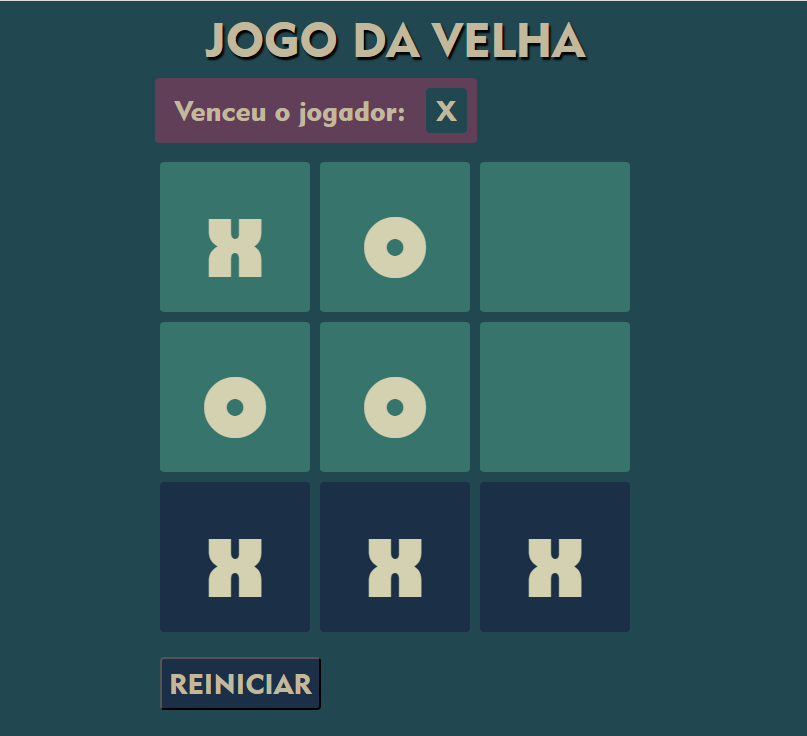

#JOGO DA VELHA

Tradicional jogo entre duas pessoas, que escolhem alternadamente um espaço vazio na área do jogo. Vence quem formar a primeiro linha com os três simbolos iguais na horizontal, vertical ou diagonal.

